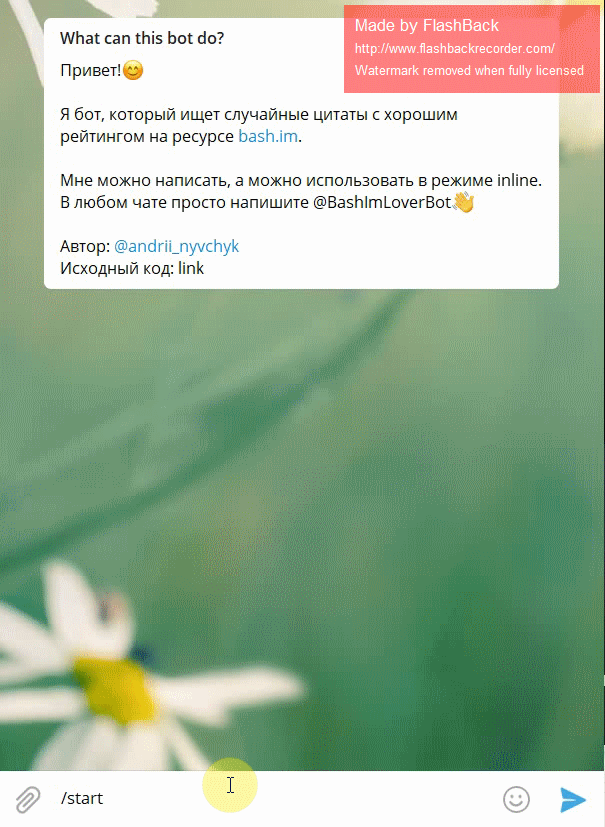
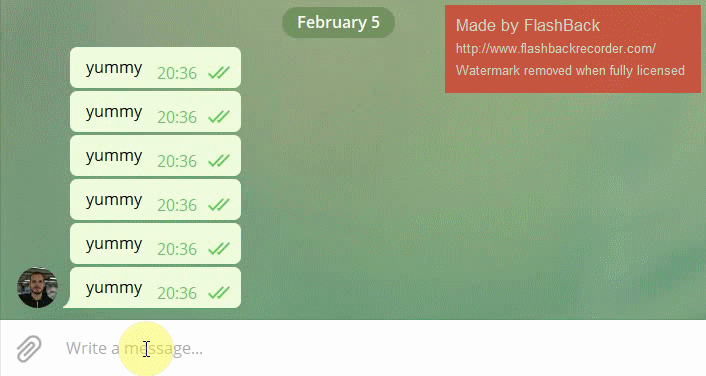

### What is "AndysBashImBot"?

It is a Telegram bot which sends random quotes from [bash.im website](bash.im).

---

### How is it done?

It is written in Ruby. It sends get requests for random qoutes, parses them and sends them to you.

As a Telegram API I've used [this Ruby wrapper](https://github.com/atipugin/telegram-bot-ruby), which was created by [@atipugin](https://github.com/atipugin).

---

### Could I run this bot on my machine?

Yes, you could do it!

1. Install Ruby
1. Install Ruby wrapper for Telegram's Bot API here: https://github.com/atipugin/telegram-bot-ruby
1. Create a Bot using [Telegram's BotFather](https://t.me/botfather)
1. Clone this repository
1. Open in any editor file `main.rb` and replace `token` in qoutes with your token from [BotFather](https://t.me/botfather)
1. Run `ruby main.rb`
1. ???
1. You are awesome!

### Screenshots
Example of messaging with the bot in a chat.
* 

Example of using the bot in an inline mode.
* 
